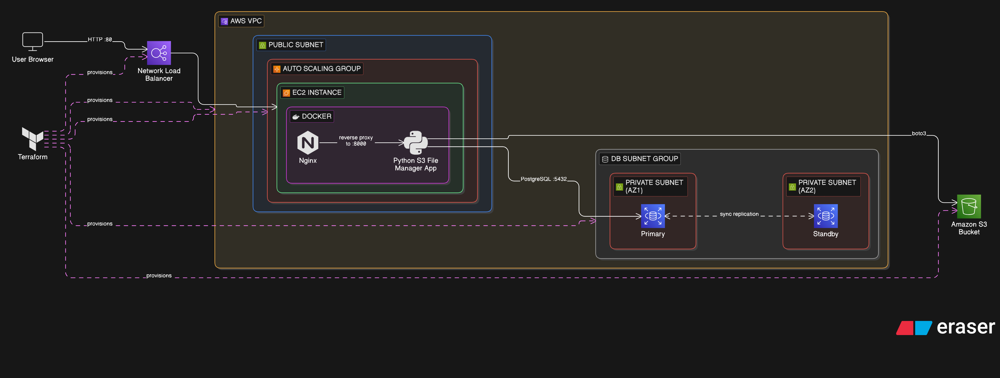

# S3 File Manager 🚀

A lightweight Python web UI for browsing and managing files in an Amazon S3 bucket.
Runs locally and stores configuration on the server.

## ✨ Features
- Web UI for listing, uploading (multi-file), downloading, deleting, and creating folders
- Prefix navigation with breadcrumbs
- Search with server-side pagination
- Sort and grid/list view toggle
- Copy S3 URIs to clipboard
- Upload progress bar and drag-and-drop support
- Preview for common file types (images, video, audio, text, PDF)
- Share links via pre-signed URLs
- Bulk actions (move, copy, delete) and rename
- Optional basic auth (username/password)
- Theme toggle (light/dark)

## ✅ Requirements
- Python 3.8+
- AWS credentials with access to the target S3 bucket
- Existing S3 bucket

## 📦 Install (Local)
```bash
python3 -m pip install -r app/requirements.txt
```

## ▶️ Run (Local)
```bash
python3 app/server.py
```

Then open `http://localhost:80` in your browser (or the port you set).

## 🐳 Docker
Build and run with compose:
```bash
docker compose -f docker/docker-compose.yml up -d --build
```

Stop:
```bash
docker compose -f docker/docker-compose.yml down
```

## ☁️ Terraform (EC2 Auto Deploy)
This repo includes Terraform that creates a VPC + EC2 instance and uses user-data
to clone this repo and start the Docker container.

### Steps
1) Configure AWS credentials locally.
2) Set your SSH key pair name in `terraform/variables.tf` (`key_name`).
3) Run Terraform:
```bash
cd terraform
terraform init
terraform apply
```
4) When it finishes, grab the public IP:
```bash
terraform output public_ip
```
5) Open in your browser:
```
http://<PUBLIC_IP>
```

### What user-data does
- Installs Docker + Docker Compose
- Clones this repository
- Runs `docker-compose up -d` from `docker/`

## ⚙️ Configuration
The app stores configuration in:
- `~/.s3-file-manager/app_config.json` (preferred)
- `/tmp/s3-file-manager/app_config.json` (fallback)

You can override paths/ports with environment variables:
- `S3FM_PORT` (default: `80`)
- `S3FM_CONFIG_DIR`

## 📝 Notes
- `/download` streams to the browser. `/download-server` saves to `/tmp/<filename>` on the server host.
- Credentials are stored locally on the server and are not encrypted.

## 🏗 Architecture Diagram



This diagram shows the full deployment architecture:
- Terraform provisions the AWS infrastructure (VPC, EC2, Security Group).
- EC2 runs Docker and Docker Compose.
- The application runs as a container and accesses Amazon S3 using an IAM Role.
- Users access the web UI via HTTP on port 80.
